# rm_NightSlashers_MiSTer

FPGA core for **Night Slashers** (Data East Corporation, 1994) targeting the
[MiSTer FPGA](https://github.com/MiSTer-devel) platform (Terasic DE10-Nano).

Night Slashers runs on the **Data East DE-0397-0 board** — a horizontal
arcade hardware with an **encrypted ARM-based main CPU (Data East chip 156)**,
a Z80 sound CPU, two DECO16IC tilemap chips (four scrolling playfields), a
custom sprite generator, the DECO ACE alpha-blend / fade mixer, DECO104
protection, and YM2151 + OKI M6295 audio.

This core reimplements the hardware in SystemVerilog from MAME references
and hardware observation.

---

# The `rm` version

*This section is the same in every `rm` core: it explains what the line is and
what it adds. Skip it if you already know.*

**`rm` cores are my own builds, published outside the MiSTer-devel tree.** They
are not a fork of the emulation: the core is the same one I contribute
upstream, plus two things the official tree cannot host, because both require
editing the `sys/` framework and MiSTer-devel does not take those changes.

### 1. CRT geometry that leaves HDMI alone

**CRT Adjust** (H-Size, H-Position, V-Shift) and **CRT V-Size** let you align
and size the picture on a 15 kHz tube from the OSD, with the sync left native
so the screen never loses lock, and without duplicating or dropping a single
line.

The point of the whole thing is *where* they sit: **sys-side**, in the analog
chain between the scanline stage and the OSD. The scaler taps the video
**before** that point, so **HDMI stays bit-identical while you adjust the
CRT** — you can align a tube without touching what a capture card or a
streaming setup sees. Putting the same modules inside the core would drag HDMI
along with every correction, which defeats the purpose.

V-Size offers two modes: **PVM** (retimes the lines — perfect on broadcast
monitors with a wide lock range) and **Cabinet** (native timing, photometric —
the sync stays rock-steady on arcade chassis with tight AFC).

### 2. Pause overlay

Logo, supporters list and scrolling credits, shown while the game is paused.

### Naming

| | |
|---|---|
| repository / folder | `rm_<Title>_MiSTer` |
| Quartus project and RBF | `rm<Title>` |
| MRA files | `rm <Title> (…).mra` |

The `rm` RBF has a **different file name** from the official core, so the two
can sit on the same SD card without overwriting each other, and you choose
which one to launch from the MRA.

### What the MiSTer-devel version has instead

Everything else, identically: savestates, audio work, video fixes, hardware
accuracy. What it does **not** have is the CRT geometry controls and the pause
overlay — the two items above.

---

## About the game

**Night Slashers** is a horror-themed side-scrolling beat-'em-up: you play a
monster hunter battling through hordes of zombies, werewolves and other
creatures across a gothic world, in the classic Data East brawler style
(Two Crude Dudes / Crude Buster lineage). Up to three players fight together
with punches, throws, weapons and over-the-top gore finishers. The DE-0397-0
board drives four scrolling playfields blended through the DECO ACE mixer for
the game's layered, moody look, with large, detailed sprites.

## Status

**Current version: 1.8** (August 2026).

The core runs the game with video, audio and inputs on real MiSTer hardware,
including the **US set** (HuC6280 sound CPU). Savestates are **enabled**, the
OKI ADPCM path is now interpolated, and the CRT geometry controls moved
**sys-side** (see "What rm means" above).

The main CPU is the **encrypted Data East 156 ARM processor** — the encrypted
ARM opcodes and the DECO56 / DECO74 tile scrambles are decrypted **on board**
during ROM download, so no pre-decrypted ROMs are needed.

## What's new in 1.8

> **This is the first release of the `rm` line, in its own repository**,
> separate from the previous one. Everything below covers what changed since
> the last public release (1.5), not just the CRT work that gave the line its
> name.

**Video**

- **Level-3 blue background: fixed.** At the night-to-day transition the
  firmware does a read-modify-write on the palette, entry by entry. The
  read-back of the buffered palette at `0x168000` was returning a stale DMA
  entry instead of the real one, so the firmware wrote a flat colour over every
  row of the landscape — that was the blue. The CPU now reads back the real
  entry from a dedicated copy of the palette, and the transition plays as it
  should.
- **Sprite engine: stretch and line repetition solved.** A long chain of work,
  each step measured on hardware:
  - the vertical **stretch** was a *partial* sprite list being copied: the DMA
    copied at every vblank, ignoring the CPU trigger, so in a slowdown the copy
    caught the list half-written. The copy now follows the trigger, exactly as
    the original board does;
  - the **final-boss glitch** was CPU writes to sprite RAM being dropped during
    the copy window — they are written through now;
  - the **line repetition** on dense 3-player scenes was the shadow-scan FIFO
    filling at 64 entries on the busiest lines; it is now 128, with an elastic
    display ring and a decoupled draw engine with cross-sprite ROM prefetch, so
    every fetch round-trip runs underneath the pixels being drawn.
  The result on hardware: no stretch, no repetition, and the fetch budget is
  no longer the limit.

- **Savestates enabled, 16 slots.** The MiSTer firmware keeps four state
  files; each one is split into four sub-slots, so the OSD offers 1–16. A
  save rewrites the region header, which is what makes the firmware notice the
  change and actually write the file. A load from a slot that was never
  written is **ignored** instead of being applied, so nothing is corrupted —
  and for the same reason state files from earlier versions are ignored rather
  than loaded on top of the new layout.
- **Savestates on the US set (HuC6280).** The sound CPU state is saved
  (including the microinstruction register, without which the CPU resumed on
  stale microcode), together with its 8 KB RAM and the bus latches. The
  **YM2151 register file** is shadowed in block RAM and **replayed into the
  chip** on restore, so instruments, note/octave and timers come back instead
  of the music resuming with whatever was left in the chip.
- **OKI ADPCM interpolation.** The 4× FIR upsampler is now enabled on all four
  OKI instances: the ADPCM stair-steps and their aliasing are gone, which was
  the "gritty" edge on sound effects.
- **Audio mixer rework.** The per-channel gain register is now 10 bits, so the
  default level no longer sits at the top of its range: the OSD percentages
  finally work in **both** directions around it. Default levels re-tuned by ear
  on hardware.
- **CRT Adjust and CRT V-Size moved sys-side**, with **HDMI left untouched**
  while adjusting. V-Size offers two modes: **PVM** (retimer, one line per
  step) and **Cabinet** (native timing, photometric) — the second keeps the
  sync rock-steady on arcade chassis with tight AFC.
- **H-Position fixed**: the OSD list wraps on its own length now, so going from
  0 to −1 moves the picture by **one pixel** instead of jumping 32.
- **`sys/` framework updated** to MiSTer-devel of 26 August 2026, which also
  brings the scaler fix for the state machine getting stuck during PLL
  reconfiguration.
- **Timing: every clock positive**, setup and hold, with zero total negative
  slack — the SDRAM command path and the ROM-download decrypt path were both
  shortened in RTL rather than papered over with constraints.
- Pause overlay supporters list updated.

## Earlier history — up to 1.5

This repository starts at 1.8. What follows happened in the previous one and is
kept here so the story of the core is in one place.

### 1.5

- **Sprite engine rework** — the vertical "stretch" on crowded scanlines is
  **gone**. The line engine now uses a decoupled draw engine with cross-sprite
  ROM prefetch, an elastic multi-buffer display ring and a deeper (128-entry)
  shadow-scan FIFO. Line-repetition on very dense, heavily-overlapping
  3-player scenes is **greatly reduced** (see Known issues for the residual
  extreme case).
- **US set (`nslasheru`) support** — the DE-0395-1 board variant with a
  **HuC6280 sound CPU** (instead of the Z80) is now emulated; the region is
  selected from the MRA.
- **All DIP switches + Service / Test menu** implemented and working. Note:
  forcing the **Violence / gore** setting on *Hard* currently works on the
  **non-Korea sets** (Japan / Overseas / US). The Korea parent simply **does
  not expose the Violence DIP** — that is how the original board ships, not a
  choice of ours; we will try to force it on Korea too if possible (see
  roadmap).
- **Savestate** infrastructure is implemented in the core but **disabled**
  (OSD entries turned off) — it still needs fixing before it can be enabled.
- **CPU Speed option** (7.08 MHz original / 10.8 / 14.1 / 28.3 MHz) — the
  original ~7 MHz ARM occasionally overruns its per-frame budget in the busiest
  scenes; raising the clock removes the overruns without speeding up the
  (vblank-locked) gameplay.
- Audio fixes on the sound path (US HuC6280 timing, sample-boundary handling).

## Known issues (v1.8)

Only one open point is left, and it may not even be ours.

- **Final boss against the wall.** Knocked down against the left wall, the boss
  can end up unable to free itself, with its attacks cancelled. The mechanism
  is fully traced in the decrypted ROM — the instruction that sets the state,
  the one that clears it, the one that cancels the attacks — and it reproduces
  on demand. Every hardware input the boss reads while it happens was checked
  against the original DECO 146 documentation and is correct.
  **MAME does exactly the same thing, step for step**, which points at the game
  code itself rather than at the emulation: the geometry of the trap traces
  back to constants and data in the ROM.
  What is still unknown is whether the original arcade board behaves the same
  way. If you own the PCB, or have a recording of that exact situation — the
  boss down against the left wall while you stand at the edge — get in touch:
  that would settle it.

## Milestones reached

- Boots and plays with accurate video and controls
- **Encrypted DECO156 ARM CPU** reproduced with the Amber ARMv2a core and
  runtime on-board decrypt (no pre-decrypted ROMs)
- On-board DECO56 (tiles1) and DECO74 (tiles2) tile decrypt during download
- DECO104 protection (I/O + data scramble) reproduced from MAME
- MAME-accurate DECO16IC tilemaps (per-row / per-column scroll)
- DECO ACE palette + alpha-blend + fade mixer, rewritten to match the Night
  Slashers video path (dynamic sprite/tilemap priority, sprite alpha, shadows)
- Sprite renderer with priority, flip, 16×16 4/5 bpp tiles, buffered sprite RAM
- **Z80 audio chain fully working**: YM2151 + 2× OKI M6295, DECO104 sound
  latch, song data served through the Z80 I/O-mapped ROM (MAME `z80_sound_io`)
- **US set audio (HuC6280)** — DE-0395-1 board variant emulated
- Sprite line-engine rework (v1.5): decoupled draw engine + cross-sprite ROM
  prefetch + elastic display ring + 128-entry shadow-scan FIFO — stretch fixed,
  line-repetition greatly reduced
- Native ~57.7 Hz refresh (PCB reference: 57.80 Hz) with an optional 60 Hz mode

## Roadmap / still to implement

- Final boss behaviour against the wall (see Known issues)
- Try to force the **Violence / gore** setting on the **main Korea parent** too
  (currently only the non-Korea sets allow it)
- Measured line count for the negative V-Shift, so it stays exact with PVM
  V-Size at any value

**Features**
- **DECO156 encrypted ARM main CPU** @ 7.0805 MHz (Amber ARMv2a core) with
  on-board opcode decrypt
- Sound CPU: Z80 @ 3.5555 MHz (World / Korea / Overseas / Japan sets) or
  **HuC6280** (US set `nslasheru`), selected from the MRA
- Two DECO16IC tilemap chips: BG0/BG1 (chip 0) + FG0/FG1 (chip 1),
  16×16 and 8×8 tiles, per-row and per-column scroll — MAME-accurate
- DECO ACE alpha-blend / fade mixer for layer composition
- Sprite renderer with priority, flip, 16×16 4/5 bpp tiles (chip0 5bpp +
  chip1 4bpp), buffered sprite RAM
- Audio: YM2151 (OPM, JT51) + OKI M6295 ADPCM (JT6295)
- On-board decrypt of the encrypted ARM CPU ROM and DECO56 / DECO74 tiles
  during ROM download — no pre-decrypted ROMs needed
- Tile ROM streaming through a 4-bank SDRAM (JTFRAME SDRAM64)
- Sprite ROM and OKI ADPCM ROM backed by DDR3
- VBlank-synchronized pause (frame-aligned, no race conditions)
- **CRT Adjust** (sys-side): H-Size, H-Position and V-Shift on the analog
  output, with the sync left native so the picture never loses lock
- **CRT V-Size** with **PVM** and **Cabinet** modes — vertical size on a 15 kHz
  CRT without duplicating or dropping a single line
- HDMI is **bit-identical** while any of the above is being adjusted
- **CPU Speed** OSD option (7.08 MHz original / 10.8 / 14.1 / 28.3 MHz) to
  clear per-frame overruns in the busiest scenes
- MiSTer OSD with video options, **DIP switches** and **Service / Test menu**
- Pause overlay with logo + supporters scroll

### A note on how the CRT controls work

The picture is not rescaled: every source pixel is emitted for an **integer**
number of pixel-clock periods through a line buffer, so H-Size is free of
shimmering and of scaling artifacts, and the content is byte-exact. The
horizontal sync is left **native** — the CRT keeps its lock while you resize
and slide the image, which is why nothing rolls or tears during adjustment.

V-Size does not duplicate or drop lines either: it retimes the line period and
the line count per frame so their product stays exactly one frame, spreading
the same unique lines further apart. In **Cabinet** mode it instead keeps the
native timing and redistributes light between adjacent lines in linear gamma,
so the sync never moves at all — made for arcade chassis with a tight AFC.

Both stages sit **sys-side**, after the scaler tap: HDMI is bit-identical
throughout. This is what the `rm` line exists for (see the top of this file).

## Screenshots

| | |
|---|---|
| 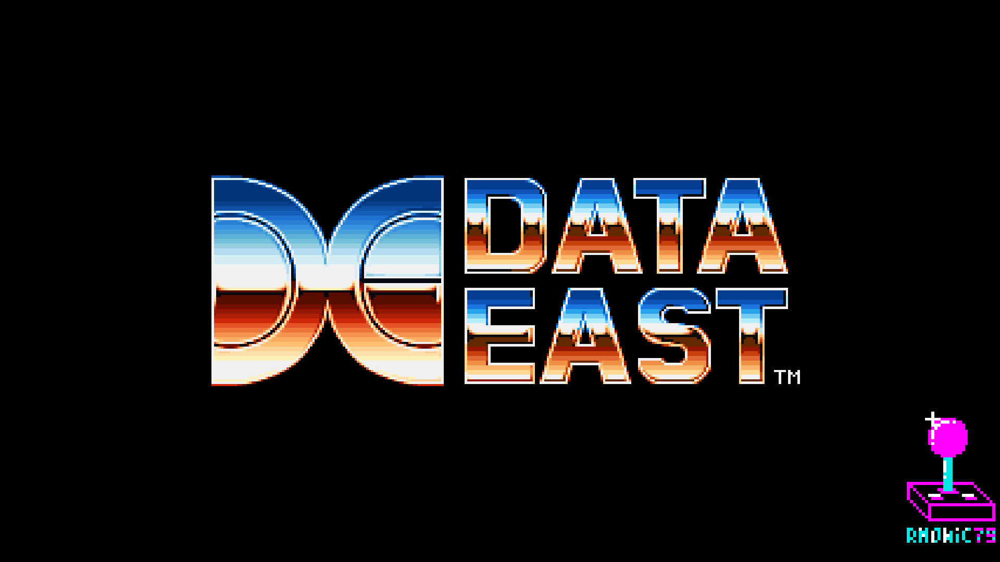 | 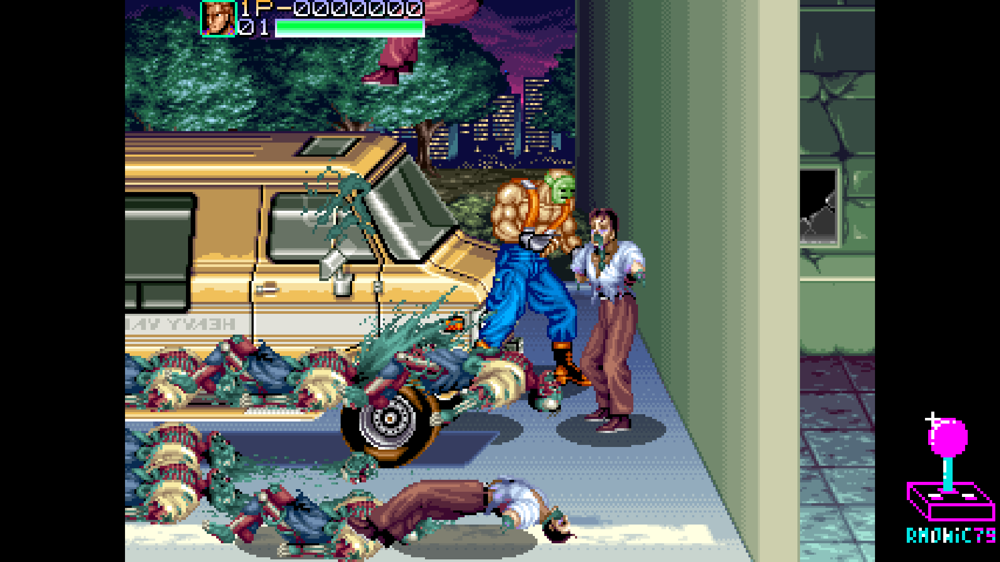 |
| Data East | Title screen |
| 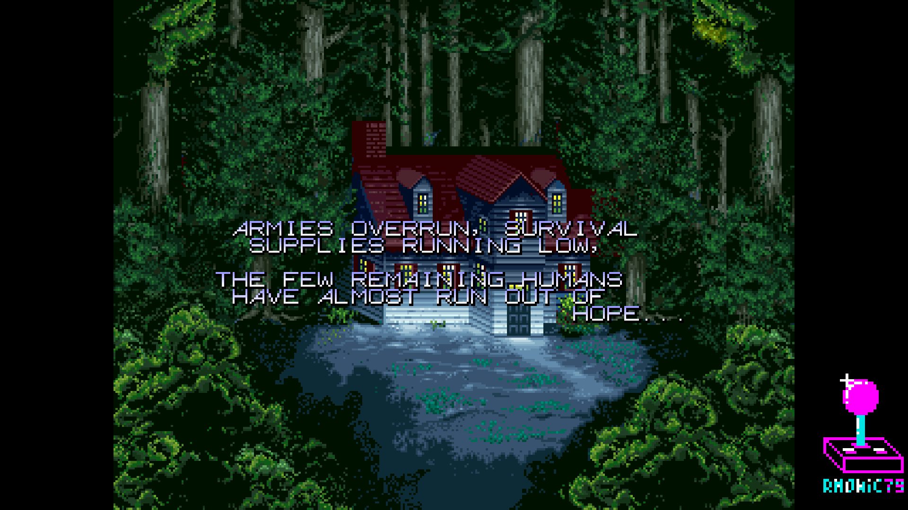 | 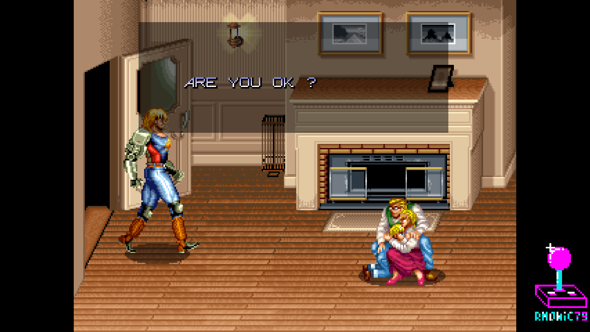 |
| Prologue | Story |
| 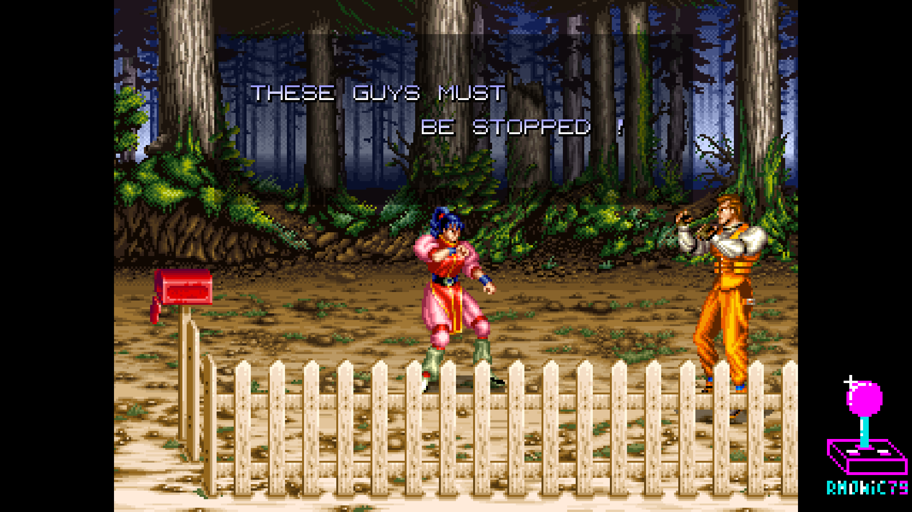 | 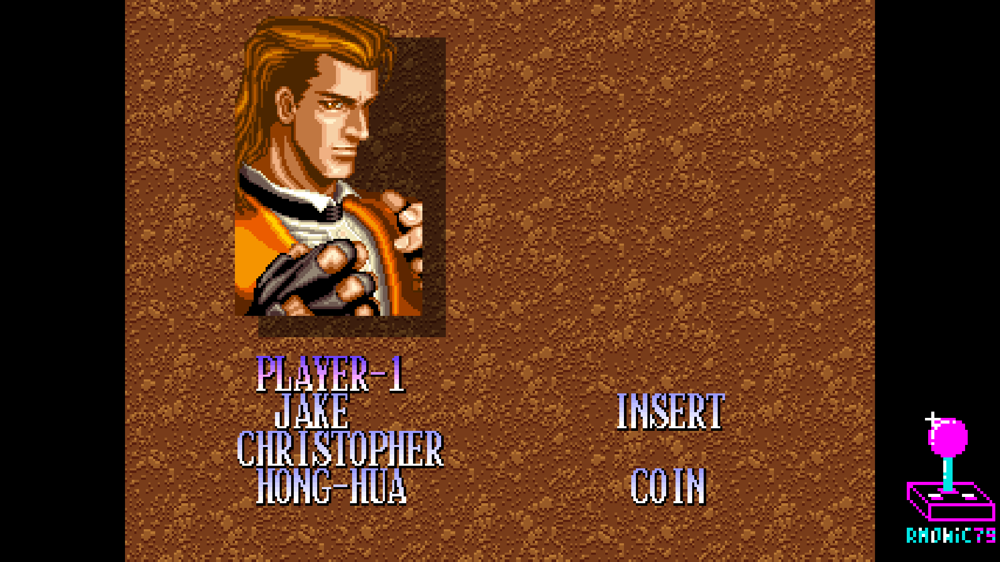 |
| Story | Character select |
| 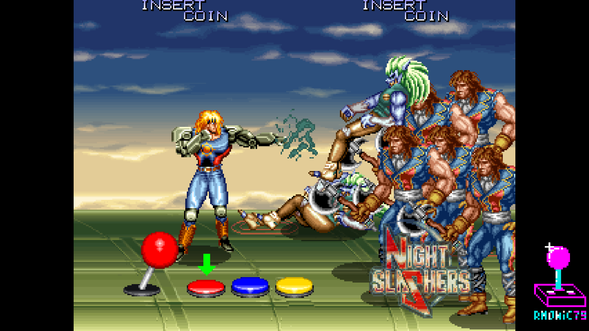 | 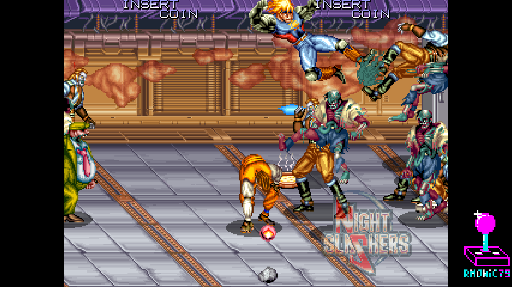 |
| Tutorial | Tutorial |
| 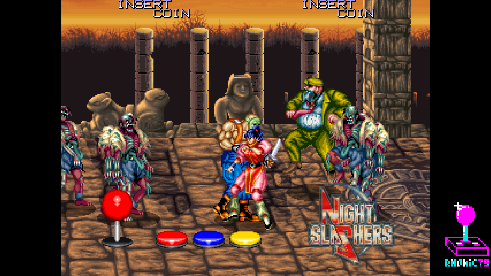 | 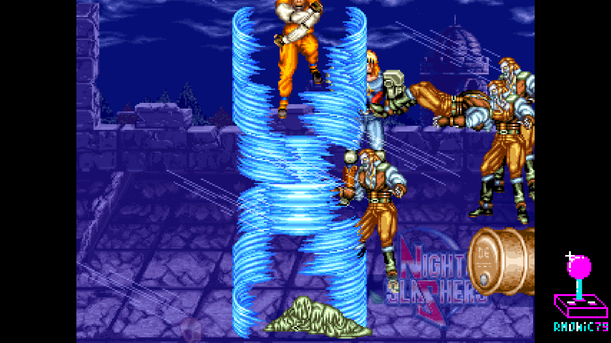 |
| Tutorial | Gameplay |
| 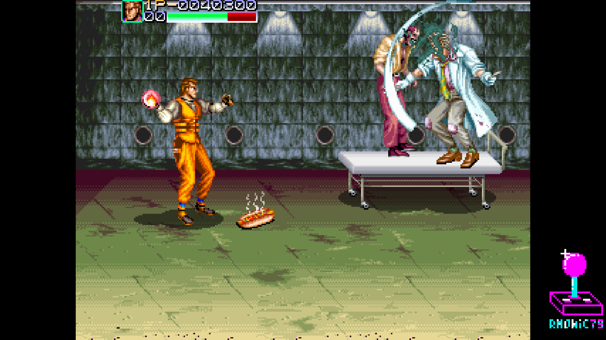 | 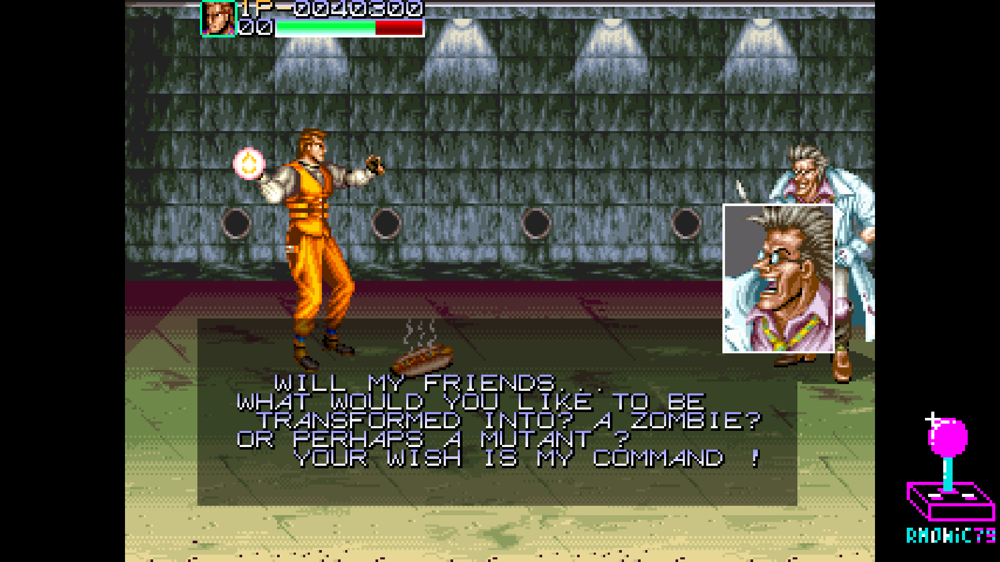 |
| Boss | Boss scene |

## Hardware emulated

| Component        | Spec                                                     |
|------------------|----------------------------------------------------------|
| Main CPU         | Data East 156 (encrypted ARMv2a) @ 7.0805 MHz            |
| Sound CPU        | Z80B @ 3.5555 MHz — or HuC6280 (US set `nslasheru`)      |
| Sound chip 1     | Yamaha YM2151 OPM (jt51)                                  |
| Sound chip 2     | OKI M6295 ×2 (jt6295)                                     |
| Tilemaps         | DECO16IC ×2 (four playfields, 16×16 / 8×8)               |
| Sprites          | DECO52 sprite generators ×2 (chip0 5bpp + chip1 4bpp)    |
| Palette / mixer  | DECO ACE (palette + alpha-blend + fade)                  |
| I/O + protection | DECO104                                                  |

## Hardware requirements

- Terasic DE10-Nano
- MiSTer I/O board (recommended)
- SDRAM module (32 MB or 64 MB)
- DDR3 memory (built into DE10-Nano, used for sprite ROM and OKI ADPCM ROM)
- Works on HDMI displays and on CRTs via the analog video output

## Building from source

Requires Quartus Prime 17.0 (free Lite Edition).

```
Open rmNightSlashers.qpf in Quartus → Processing → Start Compilation
```

Output bitstream is generated in `output_files/rmNightSlashers.rbf`.

## Running on MiSTer

The [releases/](releases/) folder contains the MRA and a prebuilt RBF:

- `rm Night Slashers (Korea Rev 1.3, DE-0397-0 PCB).mra` — parent MRA (MAME 0.288 naming)
- `rmNightSlashers_YYYYMMDD.rbf` — prebuilt bitstream

Steps:

1. Copy the `.rbf` to `_Arcade/cores/` on the MiSTer SD card, renamed to
   `rmNightSlashers.rbf` — that is the name the MRA looks for. The official
   core keeps its own name, so both can sit there together.
2. Copy the `.mra` file to `_Arcade/` on the MiSTer SD card.
3. Provide your legally-owned `nslasher.zip` where the MRA expects it
   (usually in `games/mame/`).

**ROMs are NOT included in this repository.** You must provide them yourself.

## Repository layout

```
rm_NightSlashers_MiSTer/
├── rtl/
│   ├── nightslashers/   Night Slashers-specific core RTL
│   ├── cpu_arm/         Amber ARMv2a core + DECO156 CPU wrapper
│   ├── common/          shared logic: DECO104, DECO ACE glue, decrypt, bridges
│   ├── t80/             Z80 sound CPU
│   ├── jt51/            YM2151 FM synth
│   ├── jt6295/          OKI M6295 ADPCM
│   ├── jtframe/         JTFRAME framework modules
│   ├── pll/             Clock PLL
│   └── sdram.sv         SDRAM controller (Sorgelig)
├── sys/                 MiSTer framework (Sorgelig / MiSTer-devel)
├── logo/                Pause overlay assets (font, logo, supporter list)
├── docs/                In-game screenshots
├── releases/            MRA + prebuilt RBF
├── rmNightSlashers.qpf  Quartus project
├── rmNightSlashers.qsf  Quartus assignments
├── Template.sv          Top-level wrapper
├── Template.sdc         Timing constraints
├── files.qip            HDL file list
├── build_id.v           Build version stamp
└── README.md            This file
```

## Acknowledgements

- **Conor Santifort** for the **Amber** ARMv2a CPU core (OpenCores), used to
  implement the encrypted Data East 156 ARM main CPU.
- **Jose Tejada** ([@jotego](https://github.com/jotego)) for JT51 (YM2151),
  JT6295 (OKI M6295) and the JTFRAME framework (including SDRAM64).
- **Martin Donlon** ([wickerwaka](https://github.com/wickerwaka)) for the
  savestate infrastructure, ported from the Arcade-TaitoF2 core.
- The **MAMEDev team** for the invaluable reference on the DECO16IC tilemaps,
  DECO104 protection, DECO ACE mixer, the DECO156 / DECO56 / DECO74 decrypt,
  memory maps and timing.
- **Sorgelig** and the **MiSTer-devel team** for the framework, SDRAM
  controller and Template.
- **Andrea Bogazzi** ([@asturur](https://github.com/asturur)) for help with the
  core-side Analog H-Size implementation.

## Support this project

If you enjoy this core and want to support its development:

- [Ko-fi](https://ko-fi.com/ibecerivideoludici) — one-time support
- [Patreon](https://www.patreon.com/IBeceriVideoludici) — monthly support
- [PayPal](https://www.paypal.me/IBeceriVideoludici) — one-time donation

## Follow

- [GitHub](https://github.com/rmonic79)
- [Twitch](https://twitch.tv/ibecerivideoludici) — live streams
- [YouTube](https://www.youtube.com/c/IBeceriVideoludici) — playlists and videos
- [X / Twitter](https://x.com/rmonic79)

## License

The RTL source code in this repository is provided as-is for educational
and preservation purposes under **GNU GPL v3 or later**. Original ROM data
is not included; users must provide their own legally obtained copies.

Original *Night Slashers* arcade hardware © Data East Corporation, 1994.
